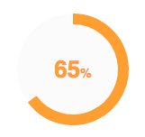

# graph-percentage-circle

polymer element with radius percentage

## USAGE :

the next example uses the element at 0% without a specified color.

    <graph-percentage-circle perc="0"></graph-percentage-circle>

===========================================

This example uses the element at 65% with a specified color.

    <graph-percentage-circle perc="65" stroke-color="#F9A03F"></graph-percentage-circle>

===========================================

This example uses the element at 100% with a specified color , Uses _no-autostart_ to stop  the animation firing at page load and then uses javascipt to play animation dinamically.

    <graph-percentage-circle perc="100" class="ele" no-autostart stroke-color="#F9A03F"></graph-percentage-circle>

    var ele = document.querySelector(".ele");
    ele.play();

## PROPERTIES :

    perc ( Integer )

      It riecives an interger between 0 and 100 and
      it's the percentage target for the animation to stop

    no-autostart ( no value )

       It doesn't require any value , the present of it in the tag stops the animation from starting by itself

## METHODS :

   play ( void )

     It starts the animation .
